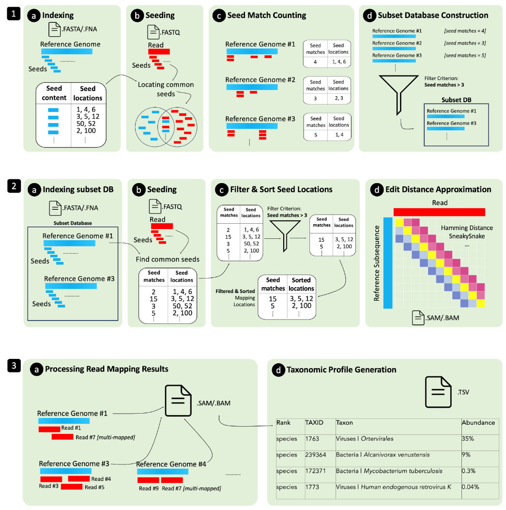

# MetaTrinity: Enabling Fast Metagenomic Classification via Seed Counting and Edit Distance Approximation

We introduce MetaTrinity, a tool based on heuristics, to achieve a fundamental improvement in accuracy-runtime tradeoff over existing methods. MetaTrinity delivers accuracy comparable to the alignment-based and highly accurate tool Metalign but with significantly enhanced efficiency. In MetaTrinity, we accelerate memory-frugal reference database indexing and filtering. We further employ heuristics to accelerate read mapping. Our evaluation demonstrates that MetaTrinity achieves a 3.9x speedup over Metalign without compromising accuracy.  
MetaTrinity has been rigorously debugged and validated using GCC 12.1.0-16.

Described by Arvid E. Gollwitzer et al. (current version at https://doi.org/10.48550/arXiv.2311.02029).

## Table of Contents
- [Installation ](#install)
- [General Usage](#use)
- [Test MetaTrinity](#test)
- [Use Cases](#usecases)
- [The Key Idea](#idea)
- [Benefits of MetaTrinity](#results)
- [Using MetaTrinity](#usage)
- [Directory Structure](#directory)
- [Getting Help](#contact)
- [Citing MetaTrinity](#cite)


## <a name="install"></a>Installation
```sh
# Download MetaTrinity
git clone https://github.com/CMU-SAFARI/MetaTrinity.git

# Compile the Containment Search (cs) Stage 
make cs -C MetaTrinity/ContainmentSearch

# Compile the Read Mapping (rm) Stage 
make rm -C MetaTrinity/ReadMapping
```


## <a name="use"></a>Usage
```sh
# The Complete Pipeline                  
python3 MetaTrinity.py <reads.fq> <Ref_DB> --output profile.tsv

# Containment Search                    
python3 containment_search.py <reads.fq> <Ref_DB> --db subset_db.fna

# Read Mapping
python3 read_mapping.py <reads.fq> <Ref_DB> --db subset_db.fna --output profile.tsv
```   


## <a name="test"></a>Test MetaTrinity 
A representative test scenario based on data for two species.  
The testing environment provides all output results from each stage under *ReproducibleEvaluation/Results*. We further measure the execution time and memory footprint of each stage.

```sh
# Run the complete MetaTrinity Pipeline
# Results are written to: ReproducibleEvaluation/Results/MetaTrinity
python3 Scripts/MetaTrinity.py ../Data/ReadSets/test.fastq ../Data/RefData/test/ --mmi_dir ../Data/RefData/test/ --temp_dir ../ReproducibleEvaluation/Results/MetaTrinity  --translation ../Data/RefData/test/translate/translate_sorted.csv --keep_temp_files --filter base-counting --edit_dist_threshold 15 --output ../ReproducibleEvaluation/Results/MetaTrinity/profile.tsv

# Run each of the three pipeline stages individually (repeated for every edit distance approximation algorithm)
# Results are written to (for each pipeline stage, respectively): 
# 1) ReproducibleEvaluation/Results/ContainmentSearch
# 2) ReproducibleEvaluation/Results/ReadMapping
# 3) ReproducibleEvaluation/Results/TaxonomicProfiling
cd ReproducibleEvaluation
./MetaTrinity-Stages.sh
```

### Expected Output
<details>
<summary>Complete MetaTrinity Pipeline</summary>
<pre>
python3 Scripts/MetaTrinity.py ../Data/ReadSets/test.fastq ../Data/RefData/test/ --mmi_dir ../Data/RefData/test/ --temp_dir ../ReproducibleEvaluation/Results/MetaTrinity  --translation ../Data/RefData/test/translate/translate_sorted.csv --keep_temp_files --filter base-counting --edit_dist_threshold 15 --output ../ReproducibleEvaluation/Results/MetaTrinity/profile.tsv
Found -n 3?, -b set 0?, mmi /home/arvidg/git/MetaTrinity/Data/RefData/test?, reads /home/arvidg/git/MetaTrinity/Data/ReadSets/test.fastq?, tr /home/arvidg/git/MetaTrinity/Data/RefData/test/translate/translate_sorted.csv?, out /home/arvidg/git/MetaTrinity/ReproducibleEvaluation/Results/MetaTrinity/ContainmentResults.csv?
fCnt is 1
Creating thread 0
[WARNING] Indexing parameters (-k, -w or -H) overridden by parameters used in the prebuilt index.
[M::start::0.025*1.12] loaded/built the index for 3396 target sequence(s)
[M::mm_mapopt_update::0.027*1.12] mid_occ = 104
[M::mm_idx_stat] kmer size: 21; skip: 11; is_hpc: 0; #seq: 3396
[M::mm_idx_stat::0.028*1.11] distinct minimizers: 71318 (92.12% are singletons); average occurrences: 1.736; average spacing: 6.727; total length: 832901
minimizer-lookup: 0 dp: 0 rmq: 0 rmq_t1: 0 rmq_t2: 0 rmq_t3: 0 rmq_t4: 0 alignment: 0 
[M::worker_pipeline::5.869*1.01] mapped 998118 sequences
[M::start] Version: 2.24-r1122
[M::start] CMD: ./minimap2 -n 3 -t 1 /home/arvidg/git/MetaTrinity/Data/RefData/test/test.mmi /home/arvidg/git/MetaTrinity/Data/ReadSets/test.fastq
[M::start] Real time: 5.903 sec; CPU: 5.933 sec; Peak RSS: 0.250 GB
minimizer-lookup: 0 dp: 0 rmq: 0 rmq_t1: 0 rmq_t2: 0 rmq_t3: 0 rmq_t4: 0 alignment: 0 0
returning from main now
Successfully joined thread 0
merging 1 queues (REACHED)
len is 833
/home/arvidg/git/MetaTrinity/ReproducibleEvaluation/Results/MetaTrinity/ContainmentResults.csv
/usr/lib/python3.10/subprocess.py:959: RuntimeWarning: line buffering (buffering=1) isn't supported in binary mode, the default buffer size will be used
  self.stdout = io.open(c2pread, 'rb', bufsize)
[M::mm_idx_gen::0.034*1.04] collected minimizers
[M::mm_idx_gen::0.055*1.02] sorted minimizers
[M::main::0.056*1.01] loaded/built the index for 3377 target sequence(s)
[M::mm_mapopt_update::0.056*1.01] mid_occ = 1000
[M::mm_idx_stat] kmer size: 21; skip: 11; is_hpc: 0; #seq: 3377
[M::mm_idx_stat::0.058*1.01] distinct minimizers: 70661 (92.09% are singletons); average occurrences: 1.743; average spacing: 6.725; total length: 828133
[M::worker_pipeline::3.568*0.71] mapped 333334 sequences
[M::worker_pipeline::7.068*0.75] mapped 333334 sequences
[M::worker_pipeline::10.411*0.77] mapped 331450 sequences
[M::main] Version: 2.17-r974-dirty-SneakySnake
[M::main] CMD --SneakySnake-- : ../MetaTrinity/ReadMapping/rm -ax sr -t 1 -2 -n 3 -r 15 --filter=base-counting --secondary=yes ../ReproducibleEvaluation/Results/MetaTrinity/subset_db.fna ../Data/ReadSets/test.fastq
[M::main] Real time: 10.434 sec; CPU: 7.995 sec; Peak RSS: 0.159 GB
</pre>
</details>

<details>
<summary>MetaTrinity by Stages</summary>
<pre>
./MetaTrinity-Stages.sh 
<br>
=======================================================  RUNNING STAGE 1: Containment Search  ======================================================
<br>
Found -n 3?, -b set 0?, mmi /home/arvidg/git/MetaTrinity/Data/RefData/test?, reads /home/arvidg/git/MetaTrinity/Data/ReadSets/test.fastq?, tr /home/arvidg/git/MetaTrinity/Data/RefData/test/translate/translate_sorted.csv?, out /home/arvidg/git/MetaTrinity/ReproducibleEvaluation/Results/ContainmentSearch/ContainmentResults.csv?
fCnt is 1
Creating thread 0
[WARNING] Indexing parameters (-k, -w or -H) overridden by parameters used in the prebuilt index.
[M::start::0.157*0.17] loaded/built the index for 3396 target sequence(s)
[M::mm_mapopt_update::0.159*0.18] mid_occ = 104
[M::mm_idx_stat] kmer size: 21; skip: 11; is_hpc: 0; #seq: 3396
[M::mm_idx_stat::0.161*0.19] distinct minimizers: 71318 (92.12% are singletons); average occurrences: 1.736; average spacing: 6.727; total length: 832901
minimizer-lookup: 0 dp: 0 rmq: 0 rmq_t1: 0 rmq_t2: 0 rmq_t3: 0 rmq_t4: 0 alignment: 0 
[M::worker_pipeline::8.441*0.77] mapped 998118 sequences
[M::start] Version: 2.24-r1122
[M::start] CMD: ./minimap2 -n 3 -t 1 /home/arvidg/git/MetaTrinity/Data/RefData/test/test.mmi /home/arvidg/git/MetaTrinity/Data/ReadSets/test.fastq
[M::start] Real time: 8.475 sec; CPU: 6.555 sec; Peak RSS: 0.250 GB
minimizer-lookup: 0 dp: 0 rmq: 0 rmq_t1: 0 rmq_t2: 0 rmq_t3: 0 rmq_t4: 0 alignment: 0 0
returning from main now
Successfully joined thread 0
merging 1 queues (REACHED)
len is 833
/home/arvidg/git/MetaTrinity/ReproducibleEvaluation/Results/ContainmentSearch/ContainmentResults.csv
<br>
=======================================================  DONE STAGE 1 ======================================================
<br>
=======================================================  RUNNING STAGE 2: Read Mapping  ======================================================
<br>
================================== INPUT ==================================
Start value for -r: 15
End value for -r: 15
Increment for -r: 1
Number of mapping locations per read: 3
Reads: ../Data/ReadSets/test.fastq
Subset DB: Results/ContainmentSearch
<br>
================================== OUTPUT  ==================================
Results/ReadMapping
<br>
================================== ALGORITHMS ==================================
adjacency-filter base-counting edlib grim_original grim_original_tweak hd magnet qgram shd shouji sneakysnake
Read Mapping with hd 
[M::mm_idx_gen::0.038*1.03] collected minimizers
[M::mm_idx_gen::0.055*1.02] sorted minimizers
[M::main::0.055*1.02] loaded/built the index for 3377 target sequence(s)
[M::mm_mapopt_update::0.055*1.02] mid_occ = 1000
[M::mm_idx_stat] kmer size: 21; skip: 11; is_hpc: 0; #seq: 3377
[M::mm_idx_stat::0.057*1.02] distinct minimizers: 70661 (92.09% are singletons); average occurrences: 1.743; average spacing: 6.725; total length: 828133
[M::worker_pipeline::3.039*0.92] mapped 333334 sequences
[M::worker_pipeline::5.507*0.95] mapped 333334 sequences
[M::worker_pipeline::8.239*0.93] mapped 331450 sequences
[M::main] Version: 2.17-r974-dirty-SneakySnake
[M::main] CMD --SneakySnake-- : ../MetaTrinity/ReadMapping/rm -ax sr -t 1 -2 -n 3 -r 15 --filter=hd --sam-hit-only --secondary=yes Results/ContainmentSearch/subset_db.fna ../Data/ReadSets/test.fastq
[M::main] Real time: 8.258 sec; CPU: 7.660 sec; Peak RSS: 0.159 GB
================================================
<br>
Read Mapping with adjacency-filter 
[M::mm_idx_gen::0.034*1.03] collected minimizers
[M::mm_idx_gen::0.051*1.02] sorted minimizers
[M::main::0.052*1.02] loaded/built the index for 3377 target sequence(s)
[M::mm_mapopt_update::0.052*1.02] mid_occ = 1000
[M::mm_idx_stat] kmer size: 21; skip: 11; is_hpc: 0; #seq: 3377
[M::mm_idx_stat::0.053*1.02] distinct minimizers: 70661 (92.09% are singletons); average occurrences: 1.743; average spacing: 6.725; total length: 828133
[M::worker_pipeline::2.943*0.88] mapped 333334 sequences
[M::worker_pipeline::5.348*0.93] mapped 333334 sequences
[M::worker_pipeline::7.550*0.95] mapped 331450 sequences
[M::main] Version: 2.17-r974-dirty-SneakySnake
[M::main] CMD --SneakySnake-- : ../MetaTrinity/ReadMapping/rm -ax sr -t 1 -2 -n 3 -r 15 --filter=adjacency-filter --sam-hit-only --secondary=yes Results/ContainmentSearch/subset_db.fna ../Data/ReadSets/test.fastq
[M::main] Real time: 7.569 sec; CPU: 7.204 sec; Peak RSS: 0.159 GB
================================================ 
<br>
Read Mapping with base-counting 
[M::mm_idx_gen::0.036*1.10] collected minimizers
[M::mm_idx_gen::0.054*1.06] sorted minimizers
[M::main::0.055*1.06] loaded/built the index for 3377 target sequence(s)
[M::mm_mapopt_update::0.055*1.06] mid_occ = 1000
[M::mm_idx_stat] kmer size: 21; skip: 11; is_hpc: 0; #seq: 3377
[M::mm_idx_stat::0.057*1.06] distinct minimizers: 70661 (92.09% are singletons); average occurrences: 1.743; average spacing: 6.725; total length: 828133
[M::worker_pipeline::2.394*1.00] mapped 333334 sequences
[M::worker_pipeline::4.777*1.00] mapped 333334 sequences
[M::worker_pipeline::7.211*1.00] mapped 331450 sequences
[M::main] Version: 2.17-r974-dirty-SneakySnake
[M::main] CMD --SneakySnake-- : ../MetaTrinity/ReadMapping/rm -ax sr -t 1 -2 -n 3 -r 15 --filter=base-counting --sam-hit-only --secondary=yes Results/ContainmentSearch/subset_db.fna ../Data/ReadSets/test.fastq
[M::main] Real time: 7.229 sec; CPU: 7.232 sec; Peak RSS: 0.159 GB
================================================ 
<br>
Read Mapping with magnet 
[M::mm_idx_gen::0.035*1.05] collected minimizers
[M::mm_idx_gen::0.056*1.03] sorted minimizers
[M::main::0.057*1.03] loaded/built the index for 3377 target sequence(s)
[M::mm_mapopt_update::0.057*1.03] mid_occ = 1000
[M::mm_idx_stat] kmer size: 21; skip: 11; is_hpc: 0; #seq: 3377
[M::mm_idx_stat::0.059*1.03] distinct minimizers: 70661 (92.09% are singletons); average occurrences: 1.743; average spacing: 6.725; total length: 828133
[M::worker_pipeline::2.888*1.00] mapped 333334 sequences
[M::worker_pipeline::5.689*1.00] mapped 333334 sequences
[M::worker_pipeline::8.259*1.00] mapped 331450 sequences
[M::main] Version: 2.17-r974-dirty-SneakySnake
[M::main] CMD --SneakySnake-- : ../MetaTrinity/ReadMapping/rm -ax sr -t 1 -2 -n 3 -r 15 --filter=magnet --sam-hit-only --secondary=yes Results/ContainmentSearch/subset_db.fna ../Data/ReadSets/test.fastq
[M::main] Real time: 8.278 sec; CPU: 8.278 sec; Peak RSS: 0.159 GB
================================================ 
<br>
Read Mapping with qgram 
[M::mm_idx_gen::0.036*1.04] collected minimizers
[M::mm_idx_gen::0.054*1.03] sorted minimizers
[M::main::0.055*1.03] loaded/built the index for 3377 target sequence(s)
[M::mm_mapopt_update::0.055*1.03] mid_occ = 1000
[M::mm_idx_stat] kmer size: 21; skip: 11; is_hpc: 0; #seq: 3377
[M::mm_idx_stat::0.057*1.03] distinct minimizers: 70661 (92.09% are singletons); average occurrences: 1.743; average spacing: 6.725; total length: 828133
[M::worker_pipeline::2.698*0.98] mapped 333334 sequences
[M::worker_pipeline::5.131*0.99] mapped 333334 sequences
[M::worker_pipeline::7.835*0.99] mapped 331450 sequences
[M::main] Version: 2.17-r974-dirty-SneakySnake
[M::main] CMD --SneakySnake-- : ../MetaTrinity/ReadMapping/rm -ax sr -t 1 -2 -n 3 -r 15 --filter=qgram --sam-hit-only --secondary=yes Results/ContainmentSearch/subset_db.fna ../Data/ReadSets/test.fastq
[M::main] Real time: 7.855 sec; CPU: 7.765 sec; Peak RSS: 0.159 GB
================================================ 
<br>
Read Mapping with shd 
[M::mm_idx_gen::0.038*1.04] collected minimizers
[M::mm_idx_gen::0.055*1.03] sorted minimizers
[M::main::0.056*1.03] loaded/built the index for 3377 target sequence(s)
[M::mm_mapopt_update::0.056*1.03] mid_occ = 1000
[M::mm_idx_stat] kmer size: 21; skip: 11; is_hpc: 0; #seq: 3377
[M::mm_idx_stat::0.058*1.03] distinct minimizers: 70661 (92.09% are singletons); average occurrences: 1.743; average spacing: 6.725; total length: 828133
[M::worker_pipeline::2.931*1.00] mapped 333334 sequences
[M::worker_pipeline::5.593*1.00] mapped 333334 sequences
[M::worker_pipeline::7.984*1.00] mapped 331450 sequences
[M::main] Version: 2.17-r974-dirty-SneakySnake
[M::main] CMD --SneakySnake-- : ../MetaTrinity/ReadMapping/rm -ax sr -t 1 -2 -n 3 -r 15 --filter=shd --sam-hit-only --secondary=yes Results/ContainmentSearch/subset_db.fna ../Data/ReadSets/test.fastq
[M::main] Real time: 8.001 sec; CPU: 8.002 sec; Peak RSS: 0.159 GB
================================================ 
<br>
Read Mapping with shouji 
[M::mm_idx_gen::0.042*1.04] collected minimizers
[M::mm_idx_gen::0.059*1.03] sorted minimizers
[M::main::0.059*1.03] loaded/built the index for 3377 target sequence(s)
[M::mm_mapopt_update::0.059*1.03] mid_occ = 1000
[M::mm_idx_stat] kmer size: 21; skip: 11; is_hpc: 0; #seq: 3377
[M::mm_idx_stat::0.061*1.03] distinct minimizers: 70661 (92.09% are singletons); average occurrences: 1.743; average spacing: 6.725; total length: 828133
[M::worker_pipeline::2.513*1.00] mapped 333334 sequences
[M::worker_pipeline::5.157*0.98] mapped 333334 sequences
[M::worker_pipeline::7.588*0.97] mapped 331450 sequences
[M::main] Version: 2.17-r974-dirty-SneakySnake
[M::main] CMD --SneakySnake-- : ../MetaTrinity/ReadMapping/rm -ax sr -t 1 -2 -n 3 -r 15 --filter=shouji --sam-hit-only --secondary=yes Results/ContainmentSearch/subset_db.fna ../Data/ReadSets/test.fastq
[M::main] Real time: 7.607 sec; CPU: 7.405 sec; Peak RSS: 0.159 GB
================================================ 
<br>
Read Mapping with sneakysnake 
[M::mm_idx_gen::0.035*1.05] collected minimizers
[M::mm_idx_gen::0.053*1.03] sorted minimizers
[M::main::0.053*1.03] loaded/built the index for 3377 target sequence(s)
[M::mm_mapopt_update::0.054*1.03] mid_occ = 1000
[M::mm_idx_stat] kmer size: 21; skip: 11; is_hpc: 0; #seq: 3377
[M::mm_idx_stat::0.055*1.03] distinct minimizers: 70661 (92.09% are singletons); average occurrences: 1.743; average spacing: 6.725; total length: 828133
[M::worker_pipeline::2.471*0.98] mapped 333334 sequences
[M::worker_pipeline::4.850*0.99] mapped 333334 sequences
[M::worker_pipeline::7.350*0.99] mapped 331450 sequences
[M::main] Version: 2.17-r974-dirty-SneakySnake
[M::main] CMD --SneakySnake-- : ../MetaTrinity/ReadMapping/rm -ax sr -t 1 -2 -n 3 -r 15 --filter=sneakysnake --sam-hit-only --secondary=yes Results/ContainmentSearch/subset_db.fna ../Data/ReadSets/test.fastq
[M::main] Real time: 7.367 sec; CPU: 7.325 sec; Peak RSS: 0.159 GB
================================================ 
<br>
Read Mapping with edlib 
[M::mm_idx_gen::0.034*1.06] collected minimizers
[M::mm_idx_gen::0.051*1.04] sorted minimizers
[M::main::0.051*1.04] loaded/built the index for 3377 target sequence(s)
[M::mm_mapopt_update::0.051*1.04] mid_occ = 1000
[M::mm_idx_stat] kmer size: 21; skip: 11; is_hpc: 0; #seq: 3377
[M::mm_idx_stat::0.053*1.04] distinct minimizers: 70661 (92.09% are singletons); average occurrences: 1.743; average spacing: 6.725; total length: 828133
[M::worker_pipeline::2.324*1.00] mapped 333334 sequences
[M::worker_pipeline::4.614*1.00] mapped 333334 sequences
[M::worker_pipeline::6.921*1.00] mapped 331450 sequences
[M::main] Version: 2.17-r974-dirty-SneakySnake
[M::main] CMD --SneakySnake-- : ../MetaTrinity/ReadMapping/rm -ax sr -t 1 -2 -n 3 -r 15 --filter=edlib --sam-hit-only --secondary=yes Results/ContainmentSearch/subset_db.fna ../Data/ReadSets/test.fastq
[M::main] Real time: 6.927 sec; CPU: 6.928 sec; Peak RSS: 0.159 GB
================================================ 
<br>
Read Mapping with grim_original 
[M::mm_idx_gen::0.038*1.04] collected minimizers
[M::mm_idx_gen::0.055*1.03] sorted minimizers
[M::main::0.055*1.03] loaded/built the index for 3377 target sequence(s)
[M::mm_mapopt_update::0.055*1.03] mid_occ = 1000
[M::mm_idx_stat] kmer size: 21; skip: 11; is_hpc: 0; #seq: 3377
[M::mm_idx_stat::0.057*1.03] distinct minimizers: 70661 (92.09% are singletons); average occurrences: 1.743; average spacing: 6.725; total length: 828133
[M::worker_pipeline::2.433*1.00] mapped 333334 sequences
[M::worker_pipeline::4.953*1.00] mapped 333334 sequences
[M::worker_pipeline::7.307*1.00] mapped 331450 sequences
[M::main] Version: 2.17-r974-dirty-SneakySnake
[M::main] CMD --SneakySnake-- : ../MetaTrinity/ReadMapping/rm -ax sr -t 1 -2 -n 3 -r 15 --filter=grim_original --sam-hit-only --secondary=yes Results/ContainmentSearch/subset_db.fna ../Data/ReadSets/test.fastq
[M::main] Real time: 7.326 sec; CPU: 7.327 sec; Peak RSS: 0.159 GB
================================================ 
<br>
Read Mapping with grim_original_tweak 
[M::mm_idx_gen::0.036*1.05] collected minimizers
[M::mm_idx_gen::0.055*1.03] sorted minimizers
[M::main::0.056*1.03] loaded/built the index for 3377 target sequence(s)
[M::mm_mapopt_update::0.056*1.03] mid_occ = 1000
[M::mm_idx_stat] kmer size: 21; skip: 11; is_hpc: 0; #seq: 3377
[M::mm_idx_stat::0.058*1.03] distinct minimizers: 70661 (92.09% are singletons); average occurrences: 1.743; average spacing: 6.725; total length: 828133
[M::worker_pipeline::2.560*1.00] mapped 333334 sequences
[M::worker_pipeline::5.033*1.00] mapped 333334 sequences
[M::worker_pipeline::7.374*1.00] mapped 331450 sequences
[M::main] Version: 2.17-r974-dirty-SneakySnake
[M::main] CMD --SneakySnake-- : ../MetaTrinity/ReadMapping/rm -ax sr -t 1 -2 -n 3 -r 15 --filter=grim_original_tweak --sam-hit-only --secondary=yes Results/ContainmentSearch/subset_db.fna ../Data/ReadSets/test.fastq
[M::main] Real time: 7.399 sec; CPU: 7.372 sec; Peak RSS: 0.159 GB
================================================ 
<br>
=======================================================  DONE STAGE 2 ======================================================
<br>
=======================================================  RUNNING STAGE 3: Taxonomic Profiling  ======================================================
<br>
================================== INPUT ==================================
Edit distance threshold (-r): 15
Number of mapping locations (-n): 3
SAM Files: Results/ReadMapping/SAM-files
<br>
================================== OUTPUT  ==================================
Output directory: Results/TaxonomicProfiling
<br>
================================== ALGORITHMS ==================================
adjacency-filter base-counting edlib grim_original grim_original_tweak hd magnet qgram shd shouji sneakysnake 
<br>
Profiling for grim_original_tweak 
[00:00:00] Reading dbinfo file...
[00:00:02] Computing abundances for input file: Results/ReadMapping/SAM-files/grim_original_tweak__n3_r15.sam
[00:00:02] Assigning multimapped reads...
[00:00:02] Compiling and writing results...
================================================ 
<br>
Profiling for magnet 
[00:00:00] Reading dbinfo file...
[00:00:02] Computing abundances for input file: Results/ReadMapping/SAM-files/magnet__n3_r15.sam
[00:00:02] Assigning multimapped reads...
[00:00:02] Compiling and writing results...
================================================ 
<br>
Profiling for hd 
[00:00:00] Reading dbinfo file...
[00:00:02] Computing abundances for input file: Results/ReadMapping/SAM-files/hd__n3_r15.sam
[00:00:02] Assigning multimapped reads...
[00:00:02] Compiling and writing results...
================================================ 
<br>
Profiling for adjacency-filter 
[00:00:00] Reading dbinfo file...
[00:00:02] Computing abundances for input file: Results/ReadMapping/SAM-files/adjacency-filter__n3_r15.sam
[00:00:02] Assigning multimapped reads...
[00:00:02] Compiling and writing results...
================================================ 
<br>
Profiling for base-counting 
[00:00:00] Reading dbinfo file...
[00:00:02] Computing abundances for input file: Results/ReadMapping/SAM-files/base-counting__n3_r15.sam
[00:00:02] Assigning multimapped reads...
[00:00:02] Compiling and writing results...
================================================ 
<br>
Profiling for qgram 
[00:00:00] Reading dbinfo file...
[00:00:02] Computing abundances for input file: Results/ReadMapping/SAM-files/qgram__n3_r15.sam
[00:00:02] Assigning multimapped reads...
[00:00:02] Compiling and writing results...
================================================ 
<br>
Profiling for shd 
[00:00:00] Reading dbinfo file...
[00:00:02] Computing abundances for input file: Results/ReadMapping/SAM-files/shd__n3_r15.sam
[00:00:02] Assigning multimapped reads...
[00:00:02] Compiling and writing results...
================================================ 
<br>
Profiling for shouji 
[00:00:00] Reading dbinfo file...
[00:00:02] Computing abundances for input file: Results/ReadMapping/SAM-files/shouji__n3_r15.sam
[00:00:02] Assigning multimapped reads...
[00:00:02] Compiling and writing results...
================================================ 
<br>
Profiling for sneakysnake 
[00:00:00] Reading dbinfo file...
[00:00:02] Computing abundances for input file: Results/ReadMapping/SAM-files/sneakysnake__n3_r15.sam
[00:00:02] Assigning multimapped reads...
[00:00:02] Compiling and writing results...
================================================ 
<br>
Profiling for grim_original 
[00:00:00] Reading dbinfo file...
[00:00:02] Computing abundances for input file: Results/ReadMapping/SAM-files/grim_original__n3_r15.sam
[00:00:02] Assigning multimapped reads...
[00:00:02] Compiling and writing results...
================================================ 
<br>
Profiling for edlib 
[00:00:00] Reading dbinfo file...
[00:00:02] Computing abundances for input file: Results/ReadMapping/SAM-files/edlib__n3_r15.sam
[00:00:02] Assigning multimapped reads...
[00:00:02] Compiling and writing results...
================================================ 
<br>
=======================================================  DONE STAGE 3 ======================================================
</pre>
</details>

<details>
<summary>Taxonomic Profile</summary>
<pre>
@SampleID:../Data/ReadSets/test.fastq
@Version:Metalign
@Ranks: superkingdom|phylum|class|order|family|genus|species|strain
<br>
@@TAXID	RANK	TAXPATH	TAXPATHSN	PERCENTAGE	_CAMI_genomeID	_CAMI_OTU
10239	superkingdom	10239	Viruses	73.29368
2	superkingdom	2	Bacteria	25.71129
1224	phylum	2|1224	Bacteria|Proteobacteria	25.71129
1236	class	2|1224|1236	Bacteria|Proteobacteria|Gammaproteobacteria	25.71129
135619	order	2|1224|1236|135619	Bacteria|Proteobacteria|Gammaproteobacteria|Oceanospirillales	25.71129
224372	family	2|1224|1236|135619|224372	Bacteria|Proteobacteria|Gammaproteobacteria|Oceanospirillales|Alcanivoracaceae	25.71129
59753	genus	2|1224|1236|135619|224372|59753	Bacteria|Proteobacteria|Gammaproteobacteria|Oceanospirillales|Alcanivoracaceae|Alcanivorax	25.71129
239364	species	10239||||||239364	Viruses||||||uncultured human fecal virus	73.29368
172371	species	2|1224|1236|135619|224372|59753|172371	Bacteria|Proteobacteria|Gammaproteobacteria|Oceanospirillales|Alcanivoracaceae|Alcanivorax|Alcanivorax venustensis	25.71129
239364.1.1	strain	10239||||||239364|239364.1.1	Viruses||||||uncultured human fecal virus|	73.29368	239364.1.1	239364
172371.0	strain	2|1224|1236|135619|224372|59753|172371|172371.0	Bacteria|Proteobacteria|Gammaproteobacteria|Oceanospirillales|Alcanivoracaceae|Alcanivorax|Alcanivorax venustensis|Alcanivorax venustensis unknown strain	25.71129	172371.0	172371
</pre>
</details>


## <a name="usecases"></a>Use Cases
```sh
# Containment Search 
cs ../../Data/RefData/test ../../Data/ReadSets/test.fastq translate/translate_sorted_C.csv ../../ReproducibleEvaluation/Results/ContainmentSearch/ContainmentResults.csv

# Read Mapping (all edit distance approximation algorithms)
ReadMapping.sh -s 15 -e 15 -i 1 -n 3 -r ../Data/ReadSets/test.fastq -d Results/ContainmentSearch -t Results/ReadMapping/Timing -o Results/ReadMapping/SAM-files

# Taxonomic Profiling (all edit distance approximation algorithms)
TaxonomicProfiling.sh -r 15 -n 3 -s Results/ReadMapping/SAM-files -o Results/TaxonomicProfiling
```


##  <a name="idea"></a>The Key Idea 
MetaTrinity performs metagenomic classification in three stages: 1) containment search, 2) read mapping, and 3) taxonomic profiling. Each pipeline stage contains one or more sequentially executed filtering steps. The first stage (containment search) aims to filter the reference database by generating a much smaller subset database from the reference genomes that are likely to be similar to many reads in the metagenomic sample. To quickly quantify the similarity between a set of reference genomes and a set of reads, we perform seeding and count the number of seeds in each reference genome that are also present in the read set. This provides an estimate of how likely it is for each reference genome to be present in the sample. The reference genomes with a number of seed hits above a certain threshold are then included in this subset database to reduce the unnecessary computations for analyzing highly dissimilar reference genomes.
In the second pipeline stage, we perform heuristic read mapping. The goal of our read mapping stage is to filter the metagenomic read set quickly and accurately in two steps. In the first read-filtering step, we examine the mapping locations of all reads and exclude candidate locations that do not achieve a minimum number of seed hits in the subset database. We exclude an entire read sequence if this read does not have at least one mapping location in the subset database with a number of seed hits above the threshold. After this step, we are left with a set of sequence pairs. Each sequence pair consists of a subsequence extracted from a specific mapping location in the subset database and a read sequence. The mapping regions in the subset database are determined based on the locations of seed hits. To accurately quantify the similarities for all the remaining sequence pairs, the second read filtering step uses heuristic algorithms to compute an approximate edit distance for each pair. Sequence pairs with an approximated edit distance above a user-defined cutoff threshold are filtered out from further analysis. We record the associated reference genome, mapping location, and edit distance for all remaining reads.
Based on the read mapping results, we perform taxonomic profiling and relative abundance estimation in the third stage. In this pipeline stage, we perform only one filtering step: we reduce the false positive rate and improve classification accuracy by excluding all organisms with relative abundance estimates below a user-defined cutoff threshold from the final taxonomic profile.




##  <a name="results"></a>Benefits of MetaTrinity
We introduce MetaTrinity, a heuristic computational taxonomic classification approach based on Metalign. Metalign is a state-of-the-art, highly accurate alignment-based tool for metagenomic analysis. We maintain the same level of accuracy as Metalign but, through introducing heuristics, significantly enhance the speed of the analysis pipeline.
- We develop a memory-frugal reference database index structure that enables rapid reference database prefiltering, i.e., containment search. We achieve a 4x speedup over Metalign’s reference database filtering procedure.
- We accelerate the metagenomic read mapping phase by relying on heuristic methods for edit-distance approximation that provide close-to-optimal solutions significantly faster. Our heuristic and alignment-free read mapper delivers a close to fourfold runtime reduction benchmarked against minimap2.


##  <a name="usage"></a>Using MetaTrinity
A Metagenomic classification pipeline can be realized using different implementations and algorithms.
We introduce a three-step procedure: containment search, heuristic read mapping, and taxonomic profiling. Depending on the desired metagenomic analysis, these steps may be used individually or collectively.


##  <a name="directory"></a>Directory Structure
```
MetaTrinity-master
├───1. Data
    └───A. ReadSets
    └───B. RefData
├───2. MetaTrinity
    └───A. ContainmentSearch
    └───B. ReadMapping
    └───C. Scripts
├───3. ReproducibleEvaluation
    └───A. ContainmentSearch
    └───B. ReadMapping
    └───C. TaxonomicProfiling     
├───4. RawResults
├───5. Figures
```            
1. Data  
**A.** Description of the sequencing reads and metagenomic reads used in our evaluation and a metagenomic test read set.  
**B.** Instructions on how to obtain the reference genomes and RefSeq database from our evaluation. We also provide a prebuilt index to test MetaTrinity immediately.
2. MetaTrinity  
**A.** The source code of our containment search (first stage of MetaTrinity) implementation.  
**B.** The source code of our alignment-free read mapping (second stage of MetaTrinity) implementation.  
**C.** The source code of the complete MetaTrinity pipeline.
3. ReproducibleEvaluation  
We provide shell scripts and commands used to run the experimental evaluations presented in the paper. We further provide a script to run and test each stage of MetaTrinity individually. We store the output of each stage under A., B., and C., respectively.
4. RawResults  
Raw results and exact values presented in the paper.
5. Figures   
High-resolution figures included in the paper.


##  <a name="contact"></a>Getting Help
If you have suggestions for improvement, new applications, or wish to collaborate, please contact arvid.gollwitzer@safari.ethz.ch.  
If you encounter bugs or have further questions or requests, you may raise an issue on the issue page.


## <a name="cite"></a>Citing MetaTrinity
If you use MetaTrinity in your work, please cite:

> Gollwitzer, Arvid E., et al. "MetaTrinity: Enabling Fast Metagenomic Classification via Seed Counting and Edit Distance Approximation." 
> arXiv:2311.02029 (2023).

You may use the following BibTeX:

```bibtex
@misc{gollwitzer2023MetaTrinity,
      title={MetaTrinity: Enabling Fast Metagenomic Classification via Seed Counting and Edit Distance Approximation}, 
      author={Arvid E. Gollwitzer and Mohammed Alser and Joel Bergtholdt and Joel Lindegger and Maximilian-David Rumpf and Can Firtina and Serghei Mangul and Onur Mutlu},
      year={2023},
      eprint={2311.02029},
      archivePrefix={arXiv},
      primaryClass={q-bio.GN}
}

